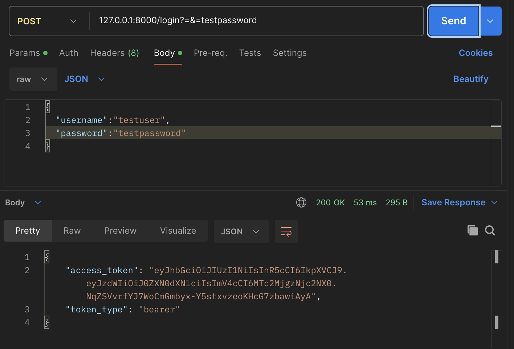
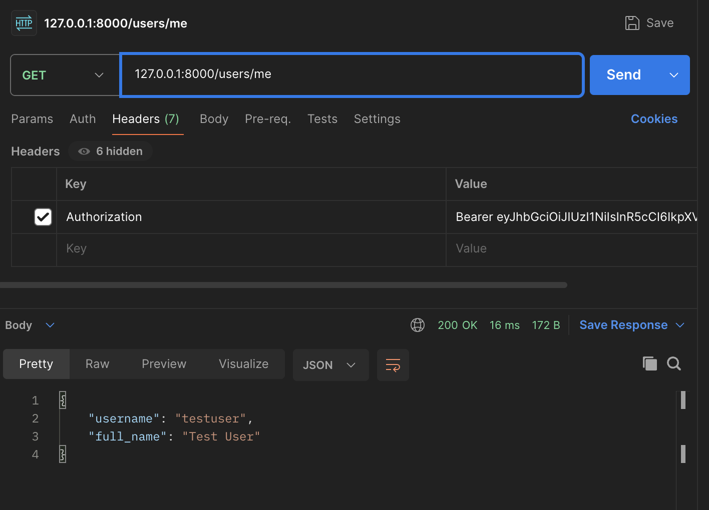
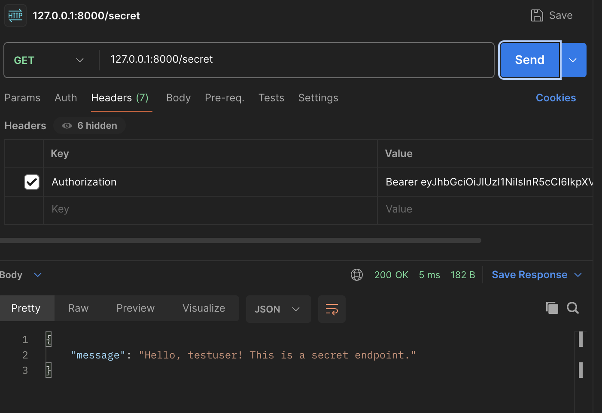

# fastapi-jwt-tutorial

This repository contains a simple FastAPI tutorial that demonstrates JWT-based authentication. The full implementation lives in `main.py`.

## Environment setup
- (Optional) Create a virtual environment in the project root with `python -m venv .venv`.
- Activate it using `source .venv/bin/activate` on macOS/Linux or `.venv\Scripts\Activate.ps1` in Windows PowerShell.
- Install the required packages via `pip install -r requirements.txt`.

## How to run
- Start the development server with `uvicorn main:app --reload`.
- If you see a version-related error from `uvicorn`, try `python -m uvicorn main:app --reload` instead.
- Request a token from `/login`, then try `/users/me` and `/secret` to walk through the JWT flow.

## Test walkthrough
The screenshots below are stored under `figs/` and show the recommended order of the walkthrough.

1. Login request

   

2. Fetch profile with the issued token

   

3. Access the protected endpoint

   